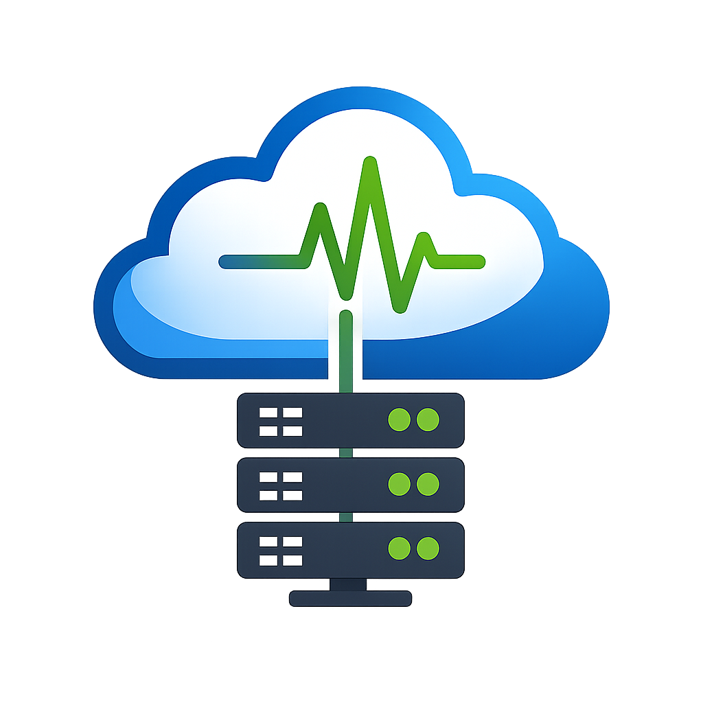
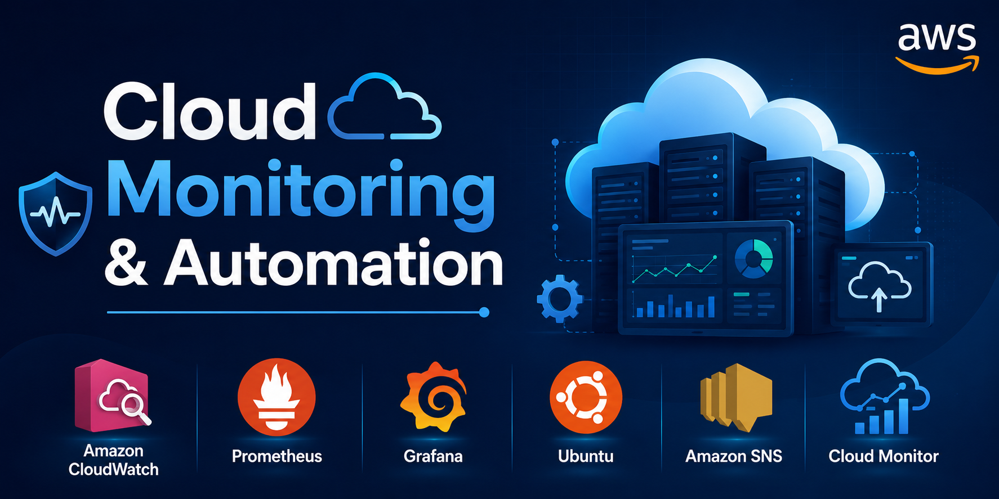
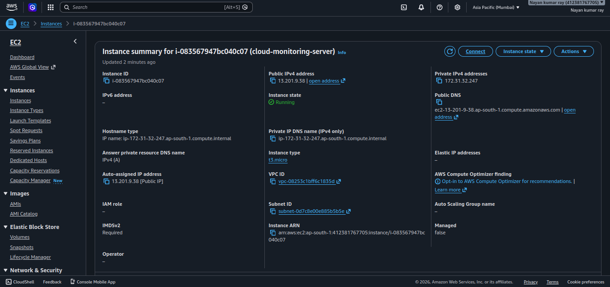
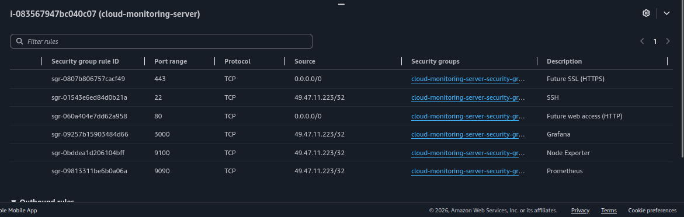
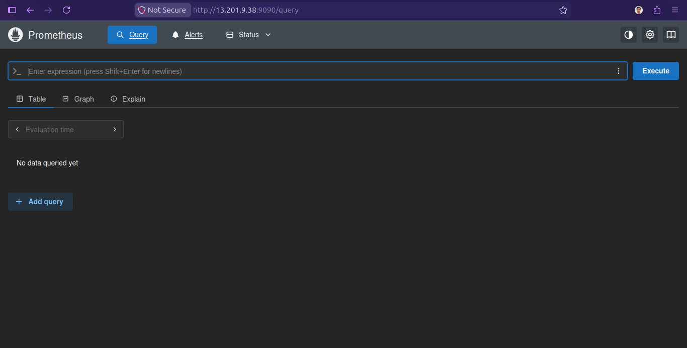
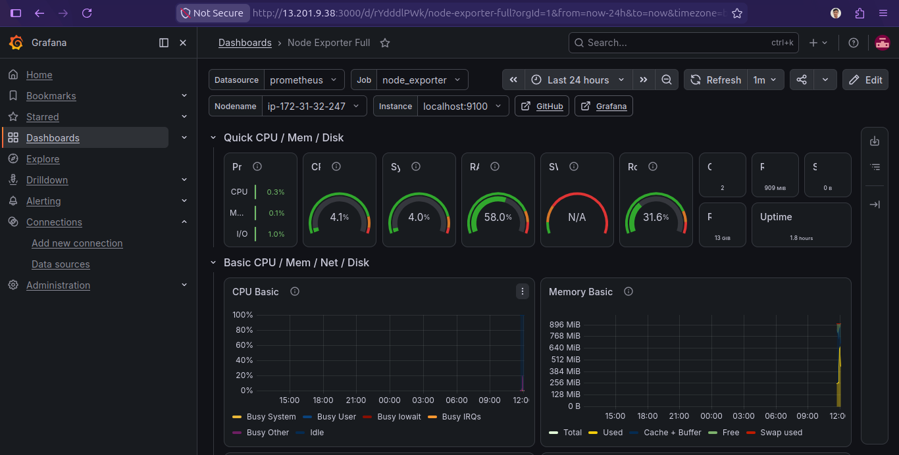
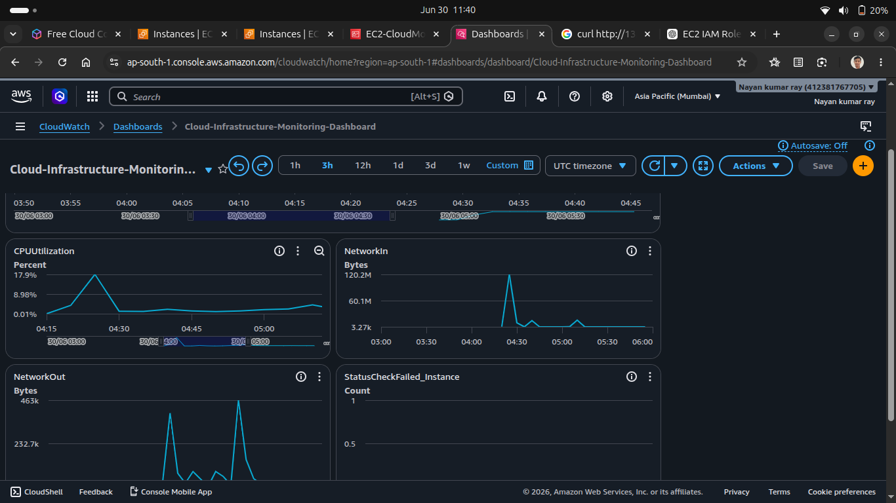
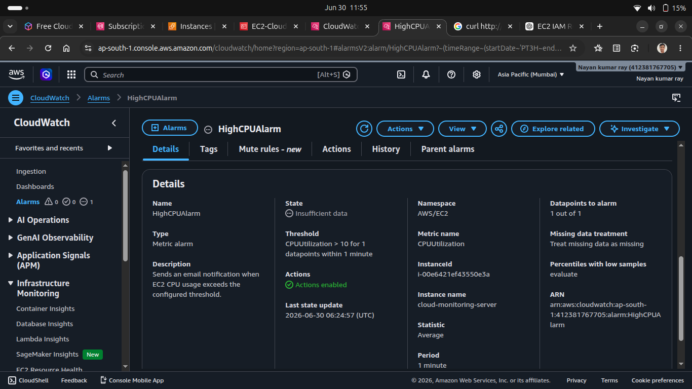
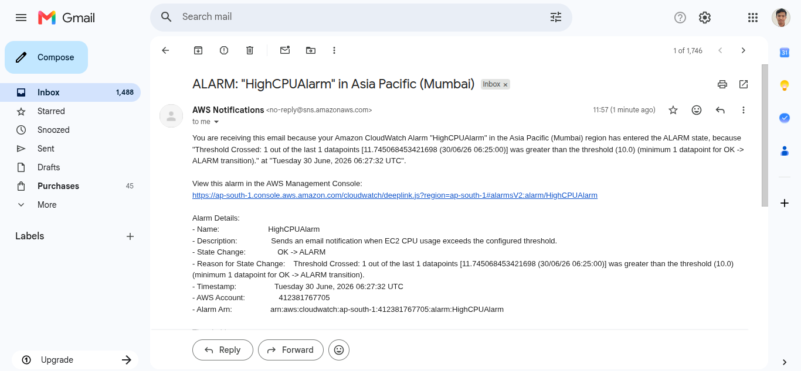

<p align="center">
  
</p>

<p align="center">
  
</p>


☁️ Cloud Infrastructure Monitoring & Self-Healing Platform

A cloud-based monitoring platform built on AWS that keeps track of server health, records important system metrics, and performs basic recovery actions when common service failures are detected.

The project combines custom Bash automation with AWS monitoring services to provide both local and cloud-based visibility into the system.


## 📖 Project Overview

I built this project to understand how server monitoring works in a cloud environment.

The platform runs on an Ubuntu EC2 instance and continuously checks important system resources such as CPU, memory, disk usage, and running services. When a problem is detected, it creates an alert and can automatically restart selected services.

Along with custom Bash scripts, I also used AWS services such as CloudWatch, IAM Roles, and Amazon SNS to learn how native AWS monitoring works. For visualization, Prometheus collects metrics from Node Exporter, and Grafana displays them through dashboards.

The main goal of this project was to gain practical experience with cloud monitoring, automation, and AWS services by building the complete workflow from scratch.

## 🎯 Project Goals

- Learn how monitoring works on AWS.
- Build a monitoring platform using Bash scripting.
- Automate regular health checks with Cron.
- Visualize system metrics using Prometheus and Grafana.
- Use CloudWatch for AWS-native monitoring.
- Configure CloudWatch Alarms and SNS notifications.
- Understand how self-healing improves service availability.

## ✨ Features

- Server health monitoring
- CPU, memory, and disk usage monitoring
- Service status monitoring
- Automatic alert generation
- Self-healing for common service failures
- Automatic log backup
- Prometheus metrics collection
- Grafana dashboards
- CloudWatch integration
- CloudWatch Dashboard
- CloudWatch Alarms
- Amazon SNS email notifications
- IAM Role for secure AWS access
- Deployment automation using Bash scripts

---

# 🏗️ System Architecture

The following diagram shows how different components work together in this project.

<p align="center">
  
</p>

<p align="center">
  
</p>

The monitoring platform runs on an Ubuntu EC2 instance. Node Exporter collects system metrics, Prometheus stores those metrics, and Grafana displays them through dashboards. At the same time, the CloudWatch Agent sends metrics and logs to Amazon CloudWatch, where alarms can trigger email notifications using Amazon SNS.

---

# 🔄 Project Workflow

```text
                Ubuntu EC2
                     │
        ┌────────────┴────────────┐
        │                         │
        ▼                         ▼
 Bash Monitoring Scripts     Node Exporter
        │                         │
        ▼                         ▼
 Alert Manager             Prometheus Server
        │                         │
        ▼                         ▼
 Self-Healing                 Grafana
        │
        ▼
 Log Files
        │
        ▼
 CloudWatch Agent
        │
        ▼
 Amazon CloudWatch
        │
        ▼
 CloudWatch Alarm
        │
        ▼
 Amazon SNS
        │
        ▼
 Email Notification
```

---

# ☁️ AWS Services Used

| Service | Purpose |
|----------|---------|
| Amazon EC2 | Hosts the monitoring platform |
| IAM Role | Secure access to AWS services |
| Amazon CloudWatch | Collects system metrics and logs |
| CloudWatch Dashboard | Displays AWS monitoring metrics |
| CloudWatch Alarm | Detects resource threshold breaches |
| Amazon SNS | Sends email notifications |

---

# 🛠️ Technology Stack

| Category | Technology |
|----------|------------|
| Cloud Platform | AWS |
| Operating System | Ubuntu Server |
| Scripting | Bash |
| Monitoring | Node Exporter |
| Metrics Collection | Prometheus |
| Visualization | Grafana |
| Cloud Monitoring | Amazon CloudWatch |
| Notifications | Amazon SNS |
| Version Control | Git & GitHub |

---
# 📊 Project Summary

| Item | Details |
|------|---------|
| Cloud Provider | AWS |
| Operating System | Ubuntu Server |
| Programming Language | Bash |
| Monitoring Tools | Node Exporter, Prometheus, Grafana |
| AWS Services | EC2, IAM, CloudWatch, SNS |
| Automation | Cron Jobs |
| Log Management | Local Logs + CloudWatch Logs |
| Notification | Email Alerts using SNS |


# 📁 Repository Structure

```text
Cloud-Infrastructure-Monitoring-and-Self-Healing-Platform/
│
├── architecture/
├── assets/
├── backup/
├── cloudwatch/
├── deployment/
├── docs/
├── logs/
├── monitoring/
├── reports/
├── screenshots/
├── scripts/
│
├── README.md
├── LICENSE
└── .gitignore
```

The repository is organized so that scripts, documentation, configurations, screenshots, and AWS resources are kept in separate folders. This makes the project easier to understand and maintain.

---

---

# 🚀 Installation

### 1. Clone the Repository

```bash
git clone https://github.com/nayan153/Cloud-Infrastructure-Monitoring-and-Self-Healing-Platform.git
```

---

### 2. Move to the Project Folder

```bash
cd Cloud-Infrastructure-Monitoring-and-Self-Healing-Platform
```

---

### 3. Make the Deployment Script Executable

```bash
chmod +x deployment/deploy.sh
```

---

### 4. Run the Deployment Script

```bash
./scripts/installation.sh
```

The script installs the required software, configures the monitoring tools, and prepares the server automatically.

> **Note:** The deployment script should be executed on an Ubuntu EC2 instance.

---

# 📷 Project Screenshots

### AWS Infrastructure

| EC2 Instance | Security Group |
|---------------|----------------|
|  |  |

---

### Monitoring Stack

| Prometheus | Grafana Dashboard |
|-------------|-------------------|
|  |  |

---

### AWS Monitoring

| CloudWatch Dashboard | CloudWatch Alarm |
|----------------------|------------------|
|  |  |

---

### Email Notification



---

# 📚 Project Documentation

Detailed documentation for each part of the project is available in the **docs** folder.

| Document | Description |
|----------|-------------|
| setup-guide.md | EC2 setup and initial configuration |
| deployment-guide.md | Server preparation and deployment |
| monitoring.md | Bash monitoring scripts |
| alert-manager.md | Alert generation process |
| self-healing.md | Automatic recovery process |
| log-backup.md | Log backup process |
| node-exporter.md | Node Exporter setup |
| prometheus.md | Prometheus configuration |
| grafana.md | Grafana setup |
| cloudwatch.md | CloudWatch Agent configuration |
| iam-role.md | IAM Role configuration |
| sns.md | SNS notification setup |
| troubleshooting.md | Common issues and solutions |
| commands-used.md | Useful commands used during the project |

---

# ⚠️ Challenges Faced

While building this project, I came across a few issues and solved them during the setup.

- Prometheus service failed because of an incorrect configuration file.
- Grafana was not accessible until the required port was allowed in the Security Group.
- CloudWatch Agent required an IAM Role before it could send metrics to AWS.
- Some monitoring scripts needed additional permissions before they could run automatically through Cron.
- Service paths had to be updated while creating systemd service files.

These issues helped me understand Linux troubleshooting and AWS configuration in more detail.

---

# 📈 Future Improvements

This project works well as a single-server monitoring platform, but there are several improvements that can make it more powerful in the future.

### Planned Improvements

- Monitor multiple EC2 instances from a single Prometheus server.
- Build custom Grafana dashboards instead of using imported templates.
- Add Docker support for easier deployment.
- Provision AWS infrastructure using Terraform.
- Deploy the monitoring platform on Kubernetes.
- Send notifications to Slack or Microsoft Teams in addition to email.
- Add a web interface to manage monitoring thresholds.
- Store monitoring logs in Amazon S3 for long-term retention.
- Use AWS Lambda to perform advanced automated recovery tasks.
- Add CI/CD using GitHub Actions for automatic deployment.

These improvements will help the project grow from a learning project into a more production-oriented monitoring solution.


---

---

# 📊 Project Outcome

After completing this project, I gained practical experience in building and managing a cloud-based monitoring platform on AWS.

The project helped me understand how different monitoring tools work together, how to automate routine system checks, and how AWS services can be used to improve monitoring and alerting.

### Key Outcomes

- Successfully deployed the monitoring platform on an AWS EC2 Ubuntu instance.
- Automated server health checks using Bash scripts and Cron jobs.
- Monitored CPU, memory, disk usage, and system services.
- Collected and visualized metrics using Node Exporter, Prometheus, and Grafana.
- Configured Amazon CloudWatch to collect system metrics and logs.
- Created CloudWatch Dashboards for centralized monitoring.
- Configured CloudWatch Alarms and Amazon SNS for email notifications.
- Used IAM Roles to securely access AWS services without storing access keys.
- Improved Linux troubleshooting and server management skills.
- Built a complete cloud project with proper documentation, architecture diagrams, screenshots, and deployment scripts.

This project gave me hands-on experience with real cloud monitoring concepts and increased my confidence in working with AWS infrastructure.
---

---

# 🎓 What I Learned

This project helped me understand how different monitoring tools work together on AWS.

Some of the main topics I learned are:

- Launching and managing EC2 instances
- Linux server administration
- Bash scripting
- Cron job automation
- Node Exporter
- Prometheus
- Grafana
- Amazon CloudWatch
- CloudWatch Alarms
- Amazon SNS
- IAM Roles
- Log management
- Basic self-healing concepts

---
---

# 🤝 Contributing

Suggestions and improvements are always welcome.

If you find a bug or have an idea to improve the project, feel free to open an issue or submit a pull request.

---

# 📄 License

This project is licensed under the MIT License.

---

# 💡 Why I Built This Project

I created this project to get hands-on experience with AWS and Linux system monitoring.

Instead of only learning the theory, I wanted to build a complete monitoring platform that could collect system metrics, generate alerts, recover common service failures, and use AWS services like CloudWatch and SNS for monitoring and notifications.

Working on this project helped me understand how different tools fit together and gave me practical experience with cloud infrastructure.


## 👨‍💻  Author

**Nayan Kumar Ray**

B.Tech Computer Science Engineering Student

Aspiring DevOps & Cloud Engineer

GitHub: https://github.com/nayan153

LinkedIn: https://www.linkedin.com/in/nayan-kumar-ray-368b89297/

If you found this project helpful, consider giving it a ⭐ on GitHub.
